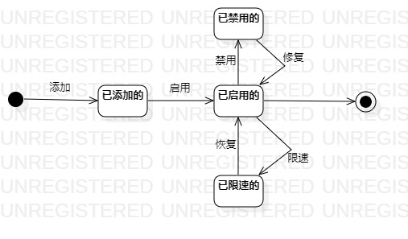

# 实验七：状态建模  
  
## 一、实验目标  
  
1. 掌握对象状态建模（状态图，Statechart)  

## 二、实验内容  

1. 寻找一个关键对象  
2. 设计该对象的关键状态  
3. 设计状态之间的转变条件  

## 三、实验步骤  
  
1. 寻找关键对象
- 路由器  
2. 设计该对象的状态
- 已添加的  
- 已启用的  
- 已禁用的  
- 已限速的  
3. 设计状态之间的转变条件  
  

## 实验结果 
  
  
图1：路由器的状态图  

