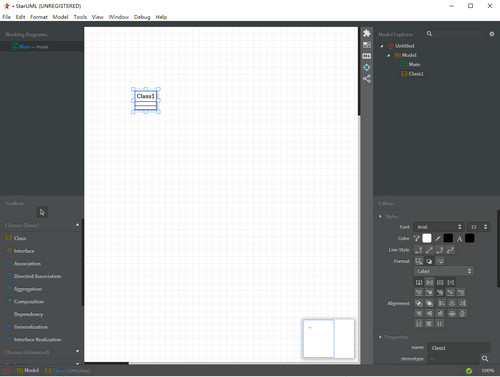

# 实验1

## 实验步骤

1. 在GitHub上fork老师的项目到自己的仓库
2. clone自己仓库里相应的项目到本地

3. 启动starUML软件并截图
4. 填写实验报告
5. 本地上传实验报告
6. 发送结果到主项目处

## 实验内容

### 软件截图

### 选题标题：Bug管理系统

+ 功能：
  - 提交：测试人员提交Bug。
  - 分发：开发组长分发Bug。
  - 修复：开发人员修复Bug。