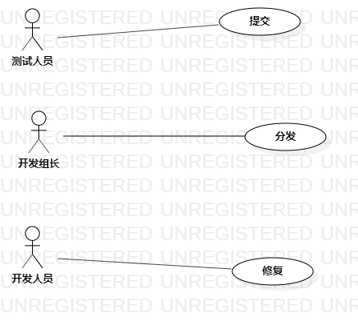

# 实验二：用例建模

## 一、实验目标

1. 掌握用例建模
2. 熟练使用StarUML

## 二、实验内容

1. 确定选题功能
2. 使用StarUML画用例图
3. 编写并提交报告

## 三、实验步骤

1. 确定Bug管理系统功能
   - 提交Bug：测试人员提交Bug。
   - 分发Bug：开发组长分发Bug。
   - 修复Bug：开发人员修复Bug。
2. 确定使用者
   - 测试人员
   - 开发组长
   - 开发人员
3. 使用StarUML画用例图

## 四、实验结果

  